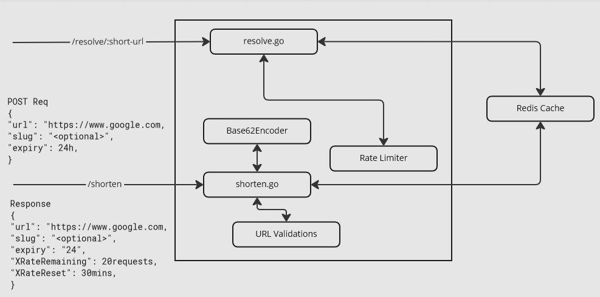

## Why build a URL shortener now?

URLs shorteners have been around for a while now and one could just pick any of the hundreds of URL Shorteners available on the web and start using it.

However building our own URL shortener has its own benefits -

1. Most URL shorteners require you to pay for creating custom URL shorts (or [slugs](https://help.short.io/en/articles/4065948-what-is-a-url-slug))
2. Many mature URL shorteners will allow you to hold your redirects only for a short period of time.
3. URL shorteners generally make money by selling URL redirects and customers' IP addresses to third parties. If you are concerned about data privacy, you would build your own URL shorteners.

## Functional Requirements

1. We should be able to generate unique short-URLs for every valid HTTPS URL
2. We should be able to resolve short-URLs quickly and redirect users to actual URLs
3. Short-URLs should have a lifetime / expiry.
4. We should be able to specifiy an optional custom short-URL. If such a custom slug is provided, we will try to map the original URL to the custom short, else we will generate a new one.

## Non Functional Requirements

1. The system will be read heavy i.e the ratio of redirects will be much higher than generating short-urls. Let's assume this ratio to be 100 : 1
2. Resolving short-urls and redirecting users to the original URL should happen instantaneously with minimal delay.

## Traffic Estimates

1. Let's assume that users generate 100K short-urls every month. That means we can expect 100K \* 100 redirects -> 10M redirects every month.
2. 10M redirects would translate to 10M / (30d \* 24h \* 3600s) = ~3 redirects a second.

## Storage Estimates

To compute storage, let's assume that we use a key-value store with the key being the short-url and the value as the original URL and the entire record to have an expiry.

```
custom-short: ~10 characters
url: ~1000 characters
ttl: int32
```

With this, we can assume that a record would be ~1KB. With 100K unique short-urls every month, we can assume our memory capacity at 100K \* 1KB = ~100 MB. For an entire year, we can assume ~1.2GB / year

## Generating the short-URL or Slug

If the user has already provided a custom-short, we will try to set that as the short-URL. Otherwise, we will have to generate a unique short-URL.

Remember that we are generating 100K short-urls per month or 1.2M short-urls a year or ~15M short-urls in 12 years :)

How do we generate unique URLs with minimal collision for 15M urls over time?

### Base62 Encoding

Our custom-short URLs have to be reasonably short 1 - 10 characters. To generate such URLS, initially we can generate a random `int64` number within a specific range `(0, 15M)`. The idea is to convert this number from `Base10` to `Base62`.

But before that, lets try to get some intuition -

Assume that the random `int64` that we generate is `234556` .

The equivalent binary or `Base2` -> `001111000010100111`.

The equivalent Hex or `Base16` -> `C3493`

The equivalent `Base64` encoded string would be -> `8q5`

The `Base64` alphabet consists of the following characters

```
const (
	alphabet      = "abcdefghijklmnopqrstuvwxyzABCDEFGHIJKLMNOPQRSTUVWXYZ0123456789/="
)
```

However, we don't want URLs to contain special characters. So we remove the slash and the equals sign and create a `Base62` alphabet and encode our `int64` to a `Base62` string.

```
const (
	alphabet      = "abcdefghijklmnopqrstuvwxyzABCDEFGHIJKLMNOPQRSTUVWXYZ012345678"
)
```

Remember, our assumption is that we would store at-most 15M shorts. So if we generate `15,000,000` as a random integer for our short, the equivalent `Base62` encoded string would be -> `El6ab`

Thats only 5 characters! What about `100,000,000` (100M)? The equivalent `Base62` would be -> `oJKVg`

You see, our short-urls / slugs are < 5 characters, which is exactly what we want.

Here is a version of a int64 -> Base62 algorithm written in `go` and the algorithm is pretty straightforward.

```
const (
	alphabet      = "abcdefghijklmnopqrstuvwxyzABCDEFGHIJKLMNOPQRSTUVWXYZ0123456789"
)

func Base62Encode(number uint64) string {
	length := len(alphabet)
	var encodedBuilder strings.Builder
	encodedBuilder.Grow(10)
	for ; number > 0; number = number / uint64(length) {
		encodedBuilder.WriteByte(alphabet[(number % uint64(length))])
	}

	return encodedBuilder.String()
}

```

## System Design

Since the title of the post has Golang and Redis, we are obviously going to use both of them to build our URL shortener service.



Redis is a fast key-value store and for our purposes, it seems like an ideal solution. For the webserver in go, I used go-fiber inspried by [Akhil Sharma's YT channel](https://www.youtube.com/watch?v=3ExDEeSnyvE). If you are from a Node.JS / Express background, you should feel at home with go-fiber.

Our primary request and response can be defined like so -

### Data Models

```
type request struct {
	URL         string        `json:"url"`
	CustomShort string        `json:"short"`
	Expiry      time.Duration `json:"expiry"`
}

type response struct {
	URL             string        `json:"url"`
	CustomShort     string        `json:"short"`
	Expiry          time.Duration `json:"expiry"`
	XRateRemaining  int           `json:"rate_limit"`
	XRateLimitReset time.Duration `json:"rate_limit_reset"`
}
```

### database.go

We will connect with Redis with a helper like so -

```
package database

import (
	"context"
	"os"

	"github.com/go-redis/redis/v8"
)

var Ctx = context.Background()

func CreateClient(dbNo int) *redis.Client {
	rdb := redis.NewClient(&redis.Options{
		Addr:     os.Getenv("DB_ADDR"),
		Password: os.Getenv("DB_PASS"),
		DB:       dbNo,
	})

	return rdb
}

```

## The shorten endpoint

The Shorten endpoint takes in the following payload -

```
{
  "url": "https://your-really-long-url/"
  "custom-short": "optional",
  "expiry": 24
}
```

The shorten URL is mapped to a `shorten.go` file. We initially validate the request by performing the following checks

### Rate Limiting

```
	r2 := database.CreateClient(1)
	defer r2.Close()

	val, err := r2.Get(database.Ctx, ctx.IP()).Result()
	limit, _ := r2.TTL(database.Ctx, ctx.IP()).Result()

	if err == redis.Nil {
    // Set quota for the current IP Address
		_ = r2.Set(database.Ctx, ctx.IP(), os.Getenv("API_QUOTA"), 30*60*time.Second).Err()
	} else if err == nil {
		valInt, _ := strconv.Atoi(val)
    // If Quota has been exhausted
		if valInt <= 0 {
			return ctx.Status(fiber.StatusServiceUnavailable).JSON(fiber.Map{
				"error":            "Rate limit exceeded",
				"rate_limit_reset": limit / time.Nanosecond / time.Minute,
			})
		}
	}
```

We use Redis-0 for storing URL Shorts and Redis-1 for managing IP Addresses & Rate limiting. Our Assumption is that the same IP Address will not be allowed to hit the /shorten end-point more than 10 times (default value in `.env`)

### Generating the Base-62 short or store the custom-short

We simply check the db for a collision before storing the generated / custom-short

```
if body.CustomShort == "" {
		id = helpers.Base62Encode(rand.Uint64())
	} else {
		id = body.CustomShort
	}

	r := database.CreateClient(0)
	defer r.Close()

	val, _ = r.Get(database.Ctx, id).Result()

	if val != "" {
		return ctx.Status(fiber.StatusForbidden).JSON(fiber.Map{
			"error": "URL Custom short is already in use",
		})
	}

	if body.Expiry == 0 {
		body.Expiry = 24
	}

	err = r.Set(database.Ctx, id, body.URL, body.Expiry*3600*time.Second).Err()
```

After generating the custom-short, we simply return the response using the struct defined above.

## The Resolve endpoint

URL resolution is pretty straightforward. We simply check for the path param against our keys in redis and redirect to the original value (URL) using a `HTTP 301 Redirect`

```
func Resolve(ctx *fiber.Ctx) error {
	url := ctx.Params("url")

	r := database.CreateClient(0)
	defer r.Close()

	value, err := r.Get(database.Ctx, url).Result()
	if err == redis.Nil {
		return ctx.Status(fiber.StatusNotFound).JSON(fiber.Map{"error": "short-url not found in db"})
	} else if err != nil {
		return ctx.Status(fiber.StatusInternalServerError).JSON(fiber.Map{"error": "Internal error"})
	}

	return ctx.Redirect(value, 301)
}
```

And that's it. We now have a fast working URL Shortener up and running. Check out the complete source code [here](https://github.com/mahadevans87/short-url). Do let me know your thoughts and feeback :)
